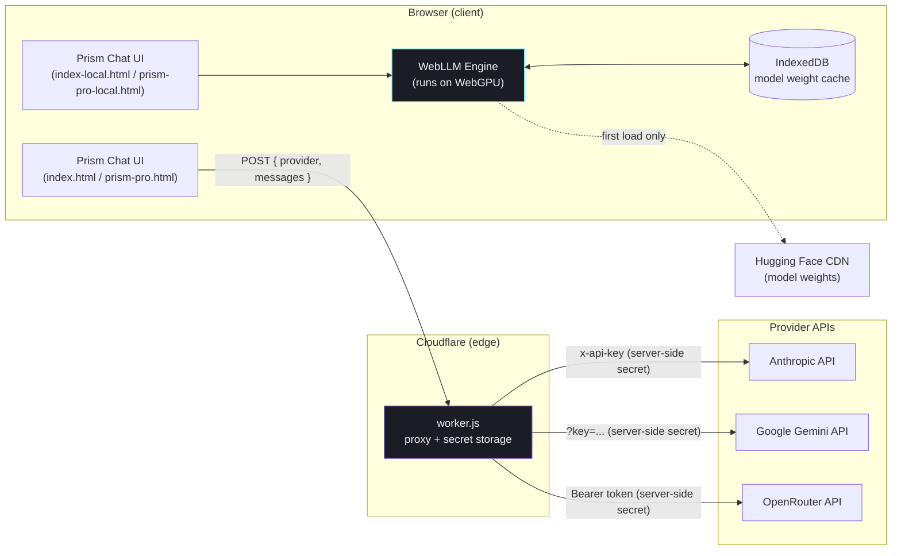
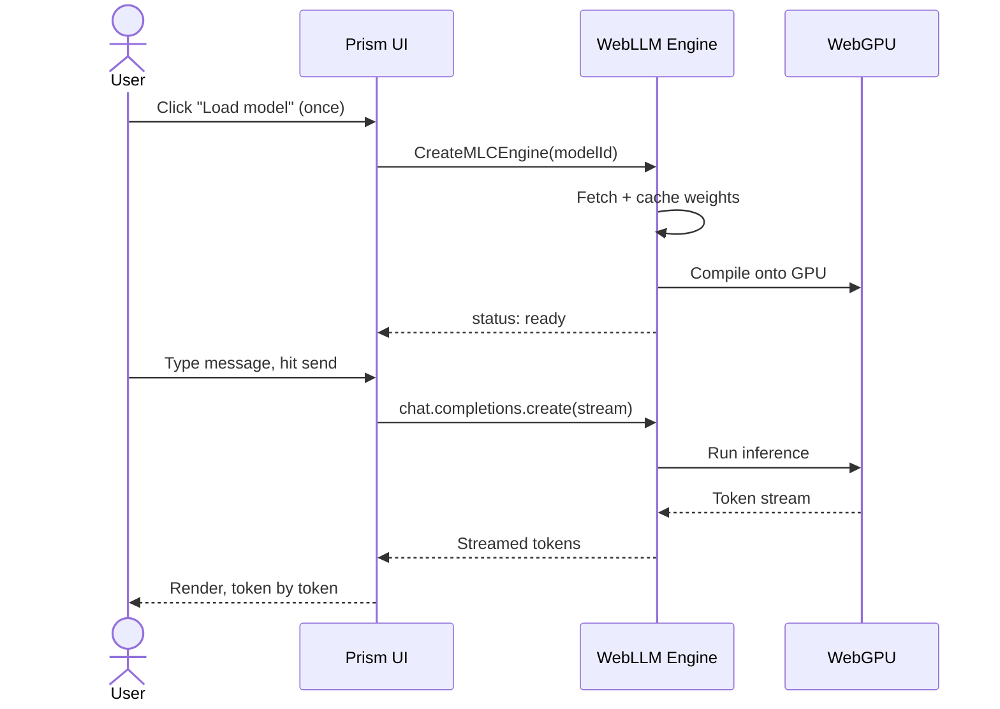
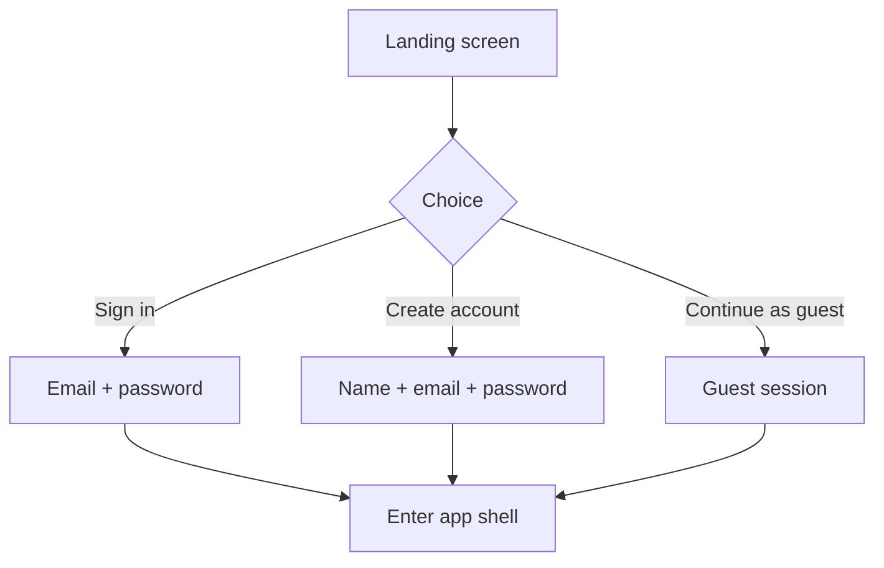

<div align="center">

# Prism

**One chat interface. Three ways to run it.**

Route a single conversation through Claude, Gemini, or OpenRouter — or skip the cloud entirely and run an open model straight in the browser via WebGPU, with zero API keys.

[](#)
[](#)
[](LICENSE)
[](#deployment)
[](#local-mode-no-api-key)

<sub>Built by <strong>Muhammad Saood Alam</strong> · AI/ML Engineer, NETSOL Technologies</sub>

</div>

---

## Why this exists

Most AI chat demos pick one path: call a cloud API, or run a model locally. Prism does both from the same interface, so it doubles as a reference implementation for two very different architectures — a secured multi-provider proxy pattern, and a fully client-side inference pattern — without duplicating the UI work.

## Variants in this repo

| File | Mode | Needs a key? | Answer quality | Best for |
|---|---|---|---|---|
| `index.html` + `worker.js` | Cloud (Claude / Gemini / OpenRouter) | No *(visitor never needs one — your key lives server-side)* | Frontier-model level | Public demos, recruiter-facing links |
| `index-local.html` | Local (WebGPU, WebLLM) | **Never, by anyone** | Good for its size class (1B–8B params) | Offline use, zero-infrastructure demos |
| `prism-pro.html` | Cloud + glass UI + login gate | Same as above | Frontier-model level | Polished, presentation-ready cloud demo |
| `prism-pro-local.html` | Local + glass UI + login gate | **Never, by anyone** | Good for its size class | Polished, presentation-ready offline demo |

All four share the same visual language (see [Design](#design)) and the same conversation UX — pin, search, export to Markdown, copy, regenerate — so switching between them is a drop-in swap, not a rewrite.

## Architecture

Prism has two independent backends behind one UI: a **cloud proxy path** and a **local inference path**. Which one a given file uses is fixed at build time (see the table above); nothing here auto-detects or switches at runtime.



**Cloud path** — the browser never sees a provider API key. `worker.js` holds `ANTHROPIC_API_KEY`, `GEMINI_API_KEY`, and `OPENROUTER_API_KEY` as Cloudflare Worker secrets, normalizes each provider's request/response shape, and returns a common `{ reply }` payload.

**Local path** — the browser downloads open model weights (Llama 3.2, Phi 3.5, or Llama 3.1, depending on the tier picked) once, caches them in IndexedDB, and runs inference on-device via WebGPU. No network call happens per message; everything after the first load works offline.

## Workflow: sending a message

The two paths diverge completely once a message is sent — this is the part worth understanding if you're extending either one.

```mermaid
sequenceDiagram
    actor U as User
    participant UI as Prism UI
    participant W as Worker (edge)
    participant P as Provider API

    U->>UI: Type message, hit send
    UI->>W: POST / { provider, model, messages }
    W->>P: Forward with server-side key
    P-->>W: Completion response
    W-->>UI: { reply }
    UI-->>U: Render assistant bubble
```

<table>
<tr><th>Cloud mode</th><th>Local mode</th></tr>
<tr valign="top"><td>



</td><td>



</td></tr>
</table>

## Auth flow

`prism-pro.html` and `prism-pro-local.html` add a glass-styled sign-in gate in front of the app shell. It's intentionally lightweight — there's no real backend account system — so treat it as a presentation layer, not production auth.



## Quick start

### Cloud mode

1. Deploy `worker.js` to Cloudflare Workers and set your provider secrets — full steps in [`docs/DEPLOYMENT.md`](docs/DEPLOYMENT.md).
2. Open `index.html` (or `prism-pro.html`), click the settings gear, paste your Worker URL.
3. Pick a provider pill (claude / gemini / openrouter) and start chatting.

### Local mode — no key, no server

1. Open `index-local.html` (or `prism-pro-local.html`) over `http://` or `https://` — **not** by double-clicking the file. Some browsers block a `file://` page from fetching external libraries, which will surface as a "could not load the model engine" error. Easiest fix: `python3 -m http.server 8000` in the folder, then visit `http://localhost:8000/index-local.html`, or just deploy it to GitHub Pages.
2. Pick a model tier: **fast** (Llama 3.2 · 1B, ~0.9 GB), **balanced** (Phi 3.5 mini · 3.8B, ~2.4 GB), or **accurate** (Llama 3.1 · 8B, ~4.6 GB).
3. Click **Load model**. First load downloads and caches the weights; every load after that is instant.
4. Chat — nothing you type ever leaves the tab.

Needs a WebGPU-capable browser (current Chrome or Edge on desktop; mobile and Safari support is inconsistent as of this writing).

## Features

- **Multi-provider routing** (cloud) — switch Claude / Gemini / OpenRouter mid-conversation; every message is tagged with which provider generated it.
- **Multi-tier local inference** — swap between fast / balanced / accurate open models without leaving the tab.
- **Glassmorphic UI** (`prism-pro*` variants) — layered blur, ambient depth, and a signature three-strand mark that encodes the "multiple models, one thread" idea visually.
- **Conversation management** — pin, search, and export any thread to a clean Markdown file.
- **Message actions** — copy any message, regenerate any assistant response.
- **Live latency readout** — real, measured response time per message, not a placeholder.
- **Streaming output** in both modes, with an automatic non-streaming fallback if a provider/engine doesn't support it mid-session.
- **Resilient model loading** — the local-mode engine tries multiple CDN sources for the WebLLM library and gives a specific, actionable error if all of them are blocked, instead of failing silently.

## Design

The signature mark is a single line splitting into three colored strands — one per provider (cloud variants) or per model tier (local variants) — used consistently across the empty state, sidebar brand, and the "thinking" indicator, so the visual identity always ties back to the "one thread, multiple models" concept rather than being a generic logo.

Typography: [Fraunces](https://fonts.google.com/specimen/Fraunces) (display/italic) for voice, [Inter](https://fonts.google.com/specimen/Inter) for UI text, [JetBrains Mono](https://fonts.google.com/specimen/JetBrains+Mono) for model/provider tags.

## Project structure

```
prism-ai/
├── index.html              # Cloud mode, base UI
├── worker.js                # Cloudflare Worker proxy (Claude / Gemini / OpenRouter)
├── index-local.html         # Local mode (WebGPU + WebLLM), base UI
├── prism-pro.html           # Cloud mode, glass UI + login gate
├── prism-pro-local.html     # Local mode, glass UI + login gate
├── docs/
│   ├── DEPLOYMENT.md        # Step-by-step Worker + Pages deployment
│   ├── ARCHITECTURE.md      # Deeper design notes and diagrams
│   └── CHANGELOG.md
├── CONTRIBUTING.md
├── LICENSE
└── README.md
```

## Roadmap

- [ ] Persist conversation history across reloads (currently in-memory by design, for a zero-dependency single file)
- [ ] Real account system behind the login gate, if this moves beyond a portfolio demo
- [ ] Streaming token-per-second readout for local mode, alongside the existing total-latency metric
- [ ] Attach-file support (the composer button is UI-only today)

## License

MIT — see [`LICENSE`](LICENSE).

## Credits

Built by **Muhammad Saood Alam**, AI Research alum at NETSOL Technologies. If you'd like the NETSOL mark itself rather than a text credit, drop in the official logo asset — it isn't bundled here out of respect for their trademark.
